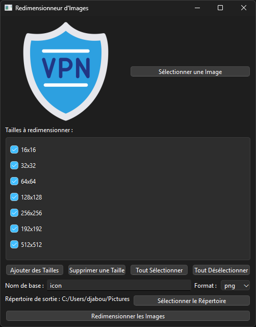

# Image Resizer Application



## Overview
This Python-based application provides a user-friendly graphical interface for resizing images to multiple predefined or custom sizes. Built using PyQt6, it allows users to quickly select an image, choose output sizes, and save resized images in various formats.

## Features
- **Drag-and-Drop Support**: Easily add images by dragging and dropping them into the application window.
- **Customizable Sizes**: Add, remove, or select specific sizes for image resizing.
- **Batch Resizing**: Resize images into multiple sizes at once.
- **Supported Formats**: PNG, JPG, BMP, GIF, and SVG.
- **Output Directory Management**: Automatically sets the output directory and allows users to change it.
- **Preview Image**: Displays a preview of the selected image before resizing.

## Installation
### Prerequisites
- Python 3.8+
- PyQt6 library

### Steps
1. Clone the repository:
   ```bash
   git clone https://github.com/yblis/resize_icon
   cd resize_icon
   ```
2. Install the required dependencies:
   ```bash
   pip install PyQt6
   ```
3. Run the application:
   ```bash
   python app.py
   ```

## Usage
1. **Select an Image**:
   - Click the "Select Image" button or drag and drop an image into the application.
2. **Choose Sizes**:
   - Use the checkboxes to select the desired output sizes.
   - Add custom sizes by clicking the "Add Sizes" button.
3. **Set Output Directory**:
   - The output directory is set automatically based on the image's location.
   - You can change it by clicking the "Select Directory" button.
4. **Set Base Name and Format**:
   - Enter a base name for the resized images.
   - Choose the output format from the dropdown menu.
5. **Resize Images**:
   - Click the "Resize Images" button to start the resizing process.
6. **View Output**:
   - Once the resizing is complete, the output directory will open automatically.

## File Structure
```
image_resizer/
├── app.py   # Main application script
└── README.md          # Documentation
```

## How It Works
1. **Image Selection**:
   - Users can select an image either by browsing or using drag-and-drop.
2. **Size Management**:
   - Predefined sizes are displayed as checkboxes.
   - Users can add custom sizes using a dialog.
3. **Resizing Process**:
   - The application resizes the image into selected sizes and saves them in the specified format.
   - If an unsupported format (e.g., SVG for raster resizing) is selected, a warning is displayed.
4. **Error Handling**:
   - The application provides user-friendly error messages for issues such as unsupported formats, missing output directories, or invalid inputs.

## Contributing
Contributions are welcome! Feel free to open issues or submit pull requests.

## License
This project is licensed under the MIT License. See the `LICENSE` file for more details.

## Acknowledgements
- PyQt6 documentation
- Open-source community for helpful resources and guidance.

